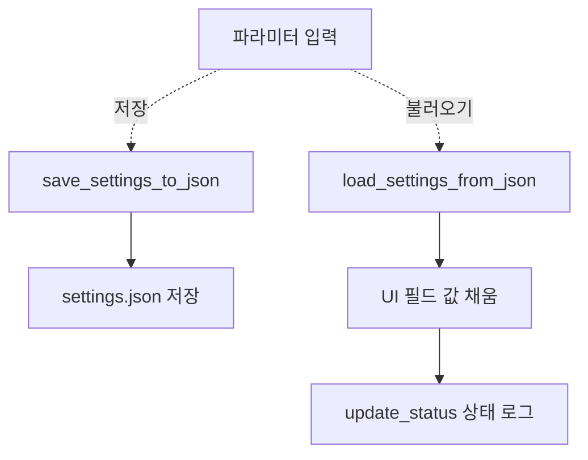
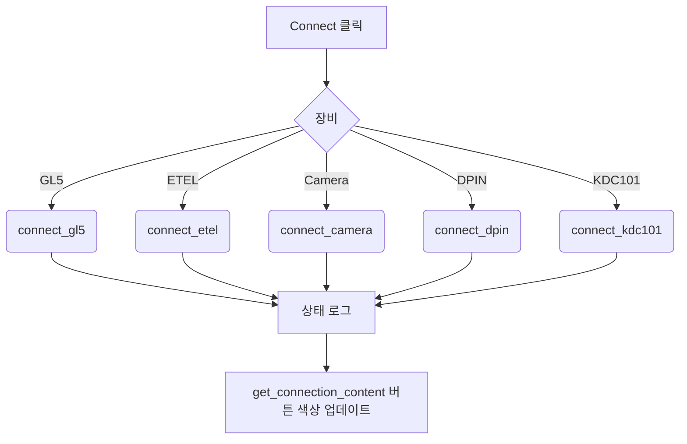
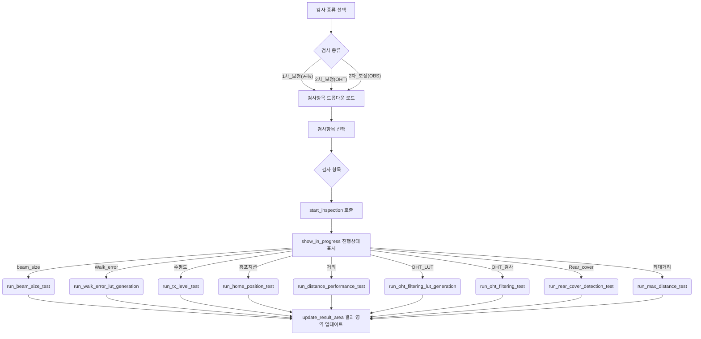
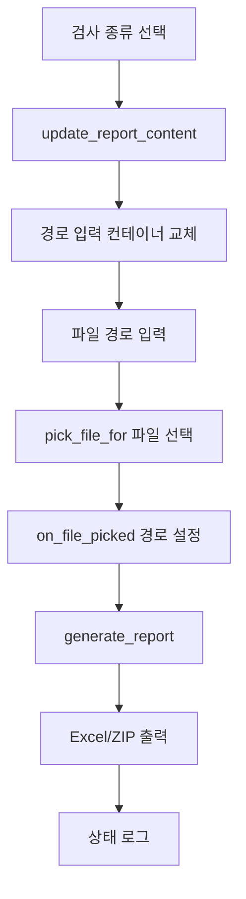
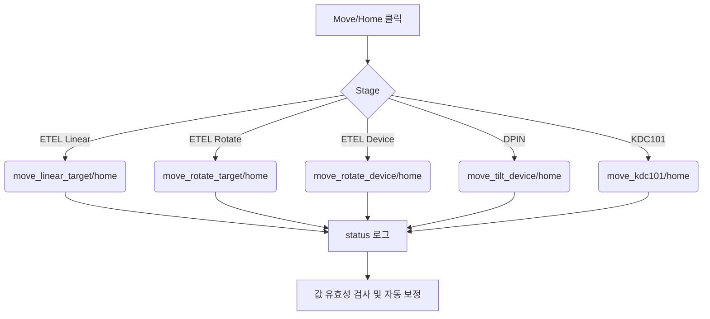

# GL-509 검사 GUI 소프트웨어 문서

## 1. 개요

이 애플리케이션은 GL-509 시리즈 센서의 1차 및 2차 보정 검사를 위한 통합 GUI 도구입니다. 다양한 검사 항목(빔 사이즈, Walk Error, 수평도, 거리 성능 등)을 지원하며, 사용자 설정, 검사 실행, 결과 표시 및 리포트 생성을 제공합니다.

---

## 2. Quick Start

### 2.1 라이브러리 설치
--requirements 파일 생성 필요--
```bash
pip install -r requirements.txt
```

필수 주요 패키지: `flet`, `opencv-python`, `numpy`, `matplotlib`, `pandas`, `pysoslab` 외

### 2.2 초기 실행 절차

1. 모든 하드웨어 전원 및 LAN/USB 연결 완료
2. `python gui_main.py` 명령으로 GUI 실행
3. [연결] 탭 → '모두 연결' 클릭(버튼이 녹색이면 성공)
4. [설정] 탭 → 설정값 확인 후 '저장'
5. [검사] 탭 → 예) '1차_보정(공통) / 빔 사이즈' 선택 → '검사 시작'
6. [리포트] 탭 → 경로 자동 입력된 폴더 확인 → '리포트 생성'

### 2.3 결과 위치 예시

```
.log/
```
## 3. 시스템 구성

| 모듈            | 설명                                       |
| ------------- | ---------------------------------------- |
| `flet`        | Python 기반 GUI 프레임워크                      |
| `functions.*` | 각 검사 항목별 실행 로직 포함                        |
| `pysoslab_*`  | SOSLAB 전용 장비 제어 API 모듈 (GL-509 센서, 카메라 등) |
| `stage_lib.*` | ETEL, DPIN 등 스테이지 장비 제어용 공통 추상화 라이브러리 |
| `gui_main.py` | GUI 로직, 이벤트 핸들링, 검사 제어 중심 모듈             |

---

## 4. 기능별 설명

### 4.1. 1차 보정 검사 (공통)

- **빔 사이즈 측정**: 중심, 크기, 편심 측정 (이미지 기반 분석)
- **Walk Error LUT 생성**: 스테이지(KDC101)를 활용한 LUT 생성 및 센서 전송

### 4.2. 2차 보정 검사 - **OHT 전용**

- **수평도 검사**: 빔 수평도(degree) 평가
- **홈포지션 검사**: 기준 위치와 실 위치 오차 측정
- **거리 성능 검사**: 정밀도/정확도 기준으로 평가
- **OHT 필터링 LUT 생성**: Min/Max LUT 테이블 생성 및 센서 전송
- **OHT 필터링 검사**: LUT 기준 검출 결과 확인
- **Rear Cover 감지 검사**: 커버 존재 여부 판단
- **최대 거리 검사**: 센서 감지 가능한 최대 거리 측정

### 4.3. 2차 보정 검사 - **OBS 전용**

- **수평도 검사**: 빔 수평도(degree) 평가
- **홈포지션 검사**: 기준 위치와 실 위치 오차 측정
- **거리 성능 검사**: 정밀도/정확도 기준으로 평가
- **최대 거리 검사**: 센서 감지 가능한 최대 거리 측정

---

## 5. 설정 파일 구조 (`settings.json`)

```json
{
  "connection": {
    "UDP_SENSOR_IP": "10.110.1.2",
    "UDP_SENSOR_PORT": 2000,
    "UDP_PC_IP": "10.110.1.3",
    "UDP_PC_PORT": 3000,
    "etel_stage_IP_addr": "10.110.1.200",
    "DPIN_gonio_IP_addr": "10.110.1.201",
    "DPIN_gonio_port": 184,
    "etel_stage_offset": -43.0
  },
  "beam_size": {...},
  "walk_error_lut": {...},
  "tx_level": {...},
  "home_position": {...},
  "distance_performance": {...},
  "OHT_filtering_table_generation": {...},
  "OHT_filtering_validation": {...},
  "rear_cover_detection": {...},
  "max_distance": {...}
}
```

> 각 검사 항목에 대한 파라미터를 JSON으로 저장/불러오기 가능

---

## 6. 프로그램 상세 구성

> 아래 각 탭은 **흐름도 → 함수·파라미터 표** 순으로 설명합니다.

### 6.1. 설정 탭



**주요 함수 및 파라미터**

| 함수                          | 주요 입력   | 주 효과                         |
| --------------------------- | ------- | ---------------------------- |
| `save_settings_to_json()`   | UI 입력 값 | `settings.json` 저장, 파라미터 동기화 |
| `load_settings_from_json()` | (없음)    | 입력 필드 값 로드, 상태 로그            |

---

### 6.2. 연결 탭



**주요 함수 및 파라미터**

| 함수                               | 주요 입력     | 주 효과                    |
| -------------------------------- | --------- | ----------------------- |
| `connect_all()/disconnect_all()` | 버튼 클릭     | 모든 장비 시퀀스 실행            |
| `connect_gl5()` 등                | 장비별 IP·포트 | 개별 연결/해제, 상태 로그         |
| `get_connection_content()`       | 연결 상태     | 연결 상태에 따른 버튼 색상 동적 변경   |

**장비별 연결 프로토콜**

| 장비      | 프로토콜    | 포트/설정                | 초기화 작업           |
| ------- | ------- | -------------------- | ---------------- |
| GL5     | UDP     | IP:Port 설정          | Serial 번호 확인     |
| ETEL    | TCP/IP  | IP 주소, 오프셋 설정       | 홈서치 및 초기화       |
| Camera  | Pylon   | 첫 번째 장치 자동 감지       | Open/Close 테스트   |
| DPIN    | TCP/IP  | IP:Port, 홈서치 실행     | 각도 초기화          |
| KDC101  | USB/RS  | 자동 감지, 홈 상태 확인      | 홈서치 또는 상태 확인    |

---

### 6.3. 검사 탭



**주요 함수 및 파라미터**

| 검사         | 실행 함수                                | 입력 파라미터                                            | 주요 결과                    | 연결 요구사항                |
| ---------- | ------------------------------------ | -------------------------------------------------- | ------------------------ | ----------------------- |
| 빔 사이즈      | `run_beam_size_test()`               | `devices`, `loaded_beam_size`                      | 원본 pkl, 결과 이미지, 타원 분석   | GL5, ETEL, DPIN, Camera |
| Walk Error | `run_walk_error_lut_generation()`    | `devices`, `loaded_walk_error`                     | LUT CSV/그래프, 센서 전송       | KDC101, GL5             |
| 수평도        | `run_tx_level_test()`                | `devices`, `loaded_tx_level`                       | 라인 이미지, pkl, Pass/Fail  | GL5, ETEL, DPIN, Camera |
| 홈포지션       | `run_home_position_test()`           | `devices`, `loaded_home_position`                  | 오차 pkl, txt 보고          | GL5, ETEL, DPIN         |
| 거리 성능      | `run_distance_performance_test()`    | `devices`, `loaded_distance_performance`           | 정밀·정확도 excel, pkl       | GL5, ETEL, DPIN         |
| OHT LUT    | `run_oht_filtering_lut_generation()` | `devices`, `loaded_OHT_filtering_table_generation` | LUT CSV/이미지, 센서 전송       | GL5, ETEL, DPIN         |
| OHT 검사     | `run_oht_filtering_test()`           | `devices`, `loaded_OHT_filtering_validation`       | 실패 포인트 excel            | GL5, ETEL, DPIN         |
| Rear Cover | `run_rear_cover_detection_test()`    | `devices`, `loaded_rear_cover_detection`           | 감지 결과 zip               | GL5, ETEL, DPIN         |
| 최대 거리      | `run_max_distance_test()`            | `devices`, `loaded_max_distance`                   | 최대 거리 pkl/zip           | GL5, ETEL, DPIN         |

**검사 실행 흐름 상세**

1. **사전 검사**: 필요한 장비 연결 상태 확인
2. **진행 표시**: `show_in_progress()` 호출로 사용자에게 진행 상태 표시
3. **검사 실행**: 각 검사별 `run_*_test()` 함수 호출
4. **결과 저장**: pickle, CSV, 이미지 등 다양한 형태로 결과 저장
5. **센서 전송**: 필요시 LUT 데이터를 센서에 전송
6. **결과 표시**: `update_result_area()` 호출로 GUI에 결과 표시
7. **경로 자동 할당**: 리포트 탭의 해당 필드에 결과 경로 자동 입력

**진행 상태 표시**
- `show_in_progress(test_name)`: 검사 진행 중 로딩 화면 표시
- ProgressRing과 메시지로 사용자 피드백 제공
- 검사 완료 후 자동으로 결과 화면으로 전환

**결과 표시 메커니즘**

`update_result_area()` 함수를 통해 검사 완료 후 결과를 GUI에 표시합니다:
- 검사 유형에 따른 동적 결과 표시
- 전역 변수(`global_*_result`)에서 결과 데이터 로드
- 이미지, 테이블, 텍스트 등 다양한 형태의 결과 표시

**검사별 결과 표시 형태**

| 검사 유형        | 표시 요소                                    | 데이터 소스                      |
| ------------ | ---------------------------------------- | ---------------------------- |
| 빔 사이즈        | 타원 이미지, 크기 정보, 편심 정보                    | `global_beam_size_result`    |
| Walk Error   | 그래프 이미지, LUT 테이블 (포맷팅된 텍스트)            | `global_walk_error_result`   |
| 수평도          | 라인 이미지, Pass/Fail 결과, 각도별 측정값 테이블       | `global_tx_level_result`     |
| 홈포지션         | Pass/Fail 결과, 오차값                       | `global_home_position_result` |
| 거리 성능        | 정밀도/정확도 테이블, Pass/Fail 상태              | `global_distance_performance_result` |
| OHT 필터링 LUT  | 1m 거리 이미지, Min/Max 테이블 (포맷팅된 텍스트)      | `global_oht_filtering_lut_result` |
| OHT 필터링 검사   | 타겟별 결과 테이블, 미감지 포인트 상세 테이블            | `global_oht_filtering_validation_result` |
| Rear Cover   | 평가 결과, 미감지 포인트 테이블                     | `global_rear_cover_detection_result` |
| 최대 거리        | 센서 각도별 결과 테이블, 감지율 정보                 | `global_max_distance_result` |

---

### 6.4. 리포트 탭



**주요 함수 및 파라미터**

| 함수                        | 주요 입력      | 주 효과                      |
| ------------------------- | ---------- | ------------------------- |
| `update_report_content()` | 드롭다운 값     | 경로 입력 컨테이너 교체             |
| `pick_file_for()`         | 텍스트 필드 참조 | 파일 선택 다이얼로그 호출            |
| `on_file_picked()`        | 선택된 파일 경로 | 해당 텍스트 필드에 경로 설정          |
| `generate_report()`       | 검사별 경로    | Excel/ZIP 리포트 생성 및 저장 경로 설정 |

**리포트 생성 상세**

| 검사 종류           | 생성 함수                                | 출력 형태        | 저장 경로                        |
| --------------- | ------------------------------------ | ------------ | ---------------------------- |
| 1차 보정검사(공통)     | `report_1st_cal_and_test`            | Excel + ZIP  | `./log/1st_cal_and_test/`    |
| 2차 보정검사(OHT)    | `report_2nd_cal_and_test_OHT`        | Excel + ZIP  | `./log/2nd_cal_and_test_OHT/` |
| 2차 보정검사(OBS)    | `report_2nd_cal_and_test_OBS`        | Excel + ZIP  | `./log/2nd_cal_and_test_OBS/` |

---

### 6.5. 수동 조작 탭



**주요 함수 및 파라미터**

| Stage              | Move/Home 함수                                | 주요 입력   | 이동 범위              | 속도 범위              | 주 효과      |
| ------------------ | ------------------------------------------- | ------- | ------------------ | ------------------ | --------- |
| ETEL Linear        | `move_linear_target()/home_linear_target()` | 거리·속도   | 0~5000mm           | 0~400mm/s          | 스테이지 이동/홈 |
| ETEL Rotate Target | `move_rotate_target()/home_rotate_target()` | 각도·속도   | -360~360deg        | 0~100deg/s         | 회전 이동/홈   |
| ETEL Rotate Device | `move_rotate_device()/home_rotate_device()` | 각도·속도   | -135~135deg        | 0~30deg/s          | 디바이스 회전   |
| DPIN Tilt          | `move_tilt_device()/home_tilt_device()`     | 각도      | -15~15deg          | 고정               | 틸트 이동/홈   |
| KDC101 Z           | `move_kdc101()/home_kdc101()`               | 위치·속도   | 제한 없음 (하드웨어 의존)   | 0~2.4mm/s          | Z축 이동/홈   |

**안전 기능**
- 모든 이동 명령 전 연결 상태 확인
- 입력값 범위 자동 보정 (범위 초과 시 최대/최소값으로 자동 설정)
- 이동 완료까지 대기 (`while is_moving()` 루프)
- 실시간 상태 로그 업데이트

### 6.6. 이벤트 핸들링 시스템

**주요 이벤트 핸들러**

| 함수                           | 트리거                | 동작                        |
| ---------------------------- | ------------------ | ------------------------- |
| `on_test_type_change()`      | 검사 종류 드롭다운 변경      | 검사 항목 드롭다운 옵션 필터링        |
| `on_inspection_type_change()` | 검사 항목 드롭다운 변경      | 결과 영역 업데이트               |
| `on_file_picked()`           | 파일 선택 다이얼로그 완료     | 선택된 파일 경로를 텍스트 필드에 설정    |
| `update_report_content()`    | 리포트 종류 드롭다운 변경     | 경로 입력 컨테이너 동적 교체         |

**상태 관리 시스템**

*상태 로그 관리*
- `update_status(message)`: 상태 메시지 추가 및 히스토리 관리
- 최대 500개 메시지 유지 (FIFO 방식)
- 자동 스크롤 (최신 메시지로 이동)
- 실시간 UI 업데이트

---

## 7. 에러 처리 및 보안

### 7.1. 연결 상태 검증
- 각 검사 실행 전 필수 장비 연결 상태 확인
- 연결되지 않은 장비가 있을 경우 검사 중단 및 사용자 알림
- 연결 실패 시 상세 에러 메시지 제공

### 7.2. 설정 입력값 검증 및 보정
- 수동 조작 시 모든 입력값 범위 검증
- 범위 초과 시 자동 보정 및 사용자 알림
- `parse_dict_from_string()` 함수를 통한 복잡한 데이터 구조 파싱

### 7.3. 파일 처리 보안
- 파일 선택 시 경로 유효성 검증
- 결과 저장 시 디렉토리 자동 생성
- ZIP 압축을 통한 안전한 데이터 저장

---

## 8. 유지보수 유의사항

### 8.1. 코드 의존성
- **필수 라이브러리**: `flet`, `opencv-python`, `numpy`, `matplotlib`, `pandas`, `openpyxl`
- **하드웨어 드라이버**: Basler Pylon SDK, ETEL 드라이버, KDC101 드라이버
- **내부 모듈**: `functions.*`, `pysoslab_*`, `stage_lib.*`

### 8.2. 디버깅 가이드
- 상태 로그를 통한 실시간 디버깅 정보 확인
- 각 검사 결과는 pickle 형태로 저장되어 사후 분석 가능
- 연결 실패 시 IP 주소 및 포트 설정 확인

### 8.3. 설정 관리
- `settings.json` 파일 백업 권장
- 새로운 파라미터 추가 시 기본값 설정 필수
- `parse_dict_from_string()` 입력 오류 처리 필수

### 8.4. 장비 제어 주의사항
- 연결 상태 확인 후 장비 제어 (GL5, ETEL, KDC101 등)
- 검사 모듈 구조 변경 시 GUI 연동 재검토
- 스테이지 이동 범위 및 속도 제한 준수

### 8.5. 확장성 고려사항
- 새로운 검사 항목 추가 시 `test_functions` 딕셔너리 업데이트
- 새로운 장비 추가 시 연결/해제 함수 쌍 구현
- 리포트 형식 변경 시 해당 `functions.report_*` 모듈 수정

### 8.6. 향후 추가 필요사항
- 빔 사이즈 검사 결과에서 최대 광량값이 100~254이내에 있는지 검사하는 코드 추가, 지금은 광량 세츄레이션 발생하거나 미달인경우에도 에러가 발생하지 않음
- walk error 보정에서 정밀도/정확도 판단 추가, 현재는 그래프로는 보여주는데 예외처리로 하지는 않음
- walk error 보정 끝나고 센서 초기값 설정, compensation 1 등...
---

## 9. 부록

### 9.1. 버전 정보
- **SW Version**: 250512a (2025‑06‑12)
- **GUI Framework**: Flet (Python)
- **지원 OS**: Windows 10/11
- **Python Version**: 3.10.11 (pysoslab 지원버전)

### 9.2. 개발 정보
- **작성자**: @YY
- **작성일**: 2025‑06‑11
- **최종 수정일**: 2025‑06‑12

### 9.3. 파일 구조
```
project/
├── gui_main.py              # 메인 GUI 애플리케이션
├── settings.json            # 설정 파일
├── functions/               # 검사 기능 모듈들
│   ├── __init__.py
│   ├── beam_size.py         # 빔 사이즈 측정
│   ├── gl507_walkerror.py   # Walk Error LUT 생성 (기본)
│   ├── gl507_walkerror_auto.py  # Walk Error LUT 생성 (자동)
│   ├── tx_level_test.py     # 수평도 검사
│   ├── home_position.py     # 홈포지션 검사
│   ├── distance_offset_and_test_v2.py   # 거리 성능 검사 (v2)
│   ├── OHT_filtering_table_generation.py  # OHT 필터링 LUT 생성
│   ├── OHT_filtering_validation.py  # OHT 필터링 검사
│   ├── rear_cover_test.py   # Rear Cover 감지 검사
│   ├── max_dist.py          # 최대 거리 검사
│   ├── spot_jig_test.py     # Spot Jig 검사 (미완성)
│   ├── spot_jig_lut_gen.py  # Spot Jig LUT 생성 (미완성)
│   ├── report_1st_cal_and_test.py       # 1차 보정 리포트 생성
│   ├── report_2nd_cal_and_test_OHT.py   # 2차 보정(OHT) 리포트 생성
│   ├── report_2nd_cal_and_test_OBS.py   # 2차 보정(OBS) 리포트 생성
│   ├── util_yy.py           # 공통 유틸리티 함수
│   ├── KDC101.py            # KDC101 제어 함수
│   ├── gl_monitoring_and_logging.py     # GL 모니터링 및 로깅
│   ├── OHT_filtering_debug.py           # OHT 필터링 디버그
│   ├── dist_debug.py        # 거리 디버그
│   ├── OHT_filtering_validation_area.json  # OHT 검증 영역 설정
│   ├── empty_area.json      # 빈 영역 설정
│   └── requirements.txt     # 필수 라이브러리 목록
├── stage_lib/              # 스테이지 제어 라이브러리
│   ├── __init__.py
│   ├── ETEL.py             # ETEL 스테이지 제어
│   └── DPIN.py             # DPIN 고니오미터 제어
├── log/                    # 검사 결과 저장 디렉토리
└── software_doc.md         # 본 문서
```

